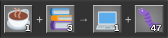
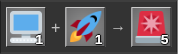
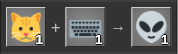
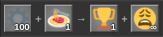

# Examples

A few recipes built with Crafty, just for fun.

## Coffee-driven development

1× Coffee + 3× Stack Overflow tabs → 1× Working code + 47× New bugs

## Works on my machine

1× "It works on my machine" + 1× Production deploy → 5× Pager alerts

## Cat-driven messaging

1× Cat + 1× Keyboard → 1× Slack message in Klingon

## Spaghetti factory

100× Iron plate + 1× Spaghetti factory → 1× Achievement + ∞× Regret

## Attribution

The icons used in the example images above are from [Twemoji](https://github.com/twitter/twemoji), copyright Twitter, Inc. and other contributors, licensed under [CC-BY 4.0](https://creativecommons.org/licenses/by/4.0/).
