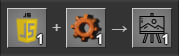

# Crafty

Crafty is a simple web application that allows users to create and visualize Factorio-like recipes.

### How to Use

#### Premade
Just use https://tranquility2.github.io/Crafty/

#### From source
Open `index.html` in your web browser to use the application.

#### Features
- **Adding/Removing Icons:**   
Use the `+` and `-` buttons next to the input and output areas to add or remove icons.

- **Updating Icons:**   
Click on an existing icon to open an edit frame. Here you can:  
🖼️ Provide an image URL or upload an image file to change the icon's appearance.   
🔢 Adjust the count displayed on the icon.   
✔️ Click "Update" to apply your changes.

- **Generating Image:**  
📷 Click the "Generate Image" button to create a static image of the current recipe build area.  
💾 Click the "Save Image" button to save the image to your computer.

### Updates 
#### Drag and Drop Image Update

You can also update an icon's image by simply dragging an image file from your computer and dropping it directly onto the desired icon in the input or output area.

---

Made with lots of ❤️ to [Factorio](https://factorio.com/) and admiration to the Wube team.

Inspired by pages like https://wiki.factorio.com/Science_pack

Dedicated to the Factorio community.
